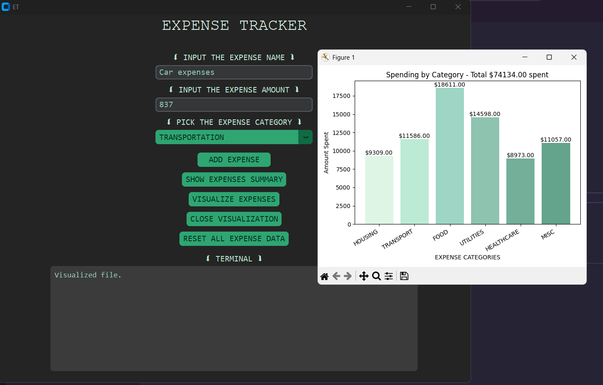

# 💸 Expense Tracker (Python + CustomTkinter)

A clean and modern **Expense Tracker** with category-based analytics and visualizations, built using **Python**, **CustomTkinter**, and **Matplotlib**.

## ✨ Features
- Add expenses with name, amount, and category
- Six default categories (Housing, Transport, Food, Utilities, Healthcare, Miscellaneous)
- Expense summary with **total calculation**
- Bar chart visualization of spending by category
- Reset/clear all data option
- Modern UI using **CustomTkinter**

## 🛠 Installation
```bash
git clone https://github.com/atharvtkn/expense-tracker.git
cd expense-tracker
pip install -r requirements.txt
```

## Usage
```bash
python maingui.py
```

## 📸 Preview

